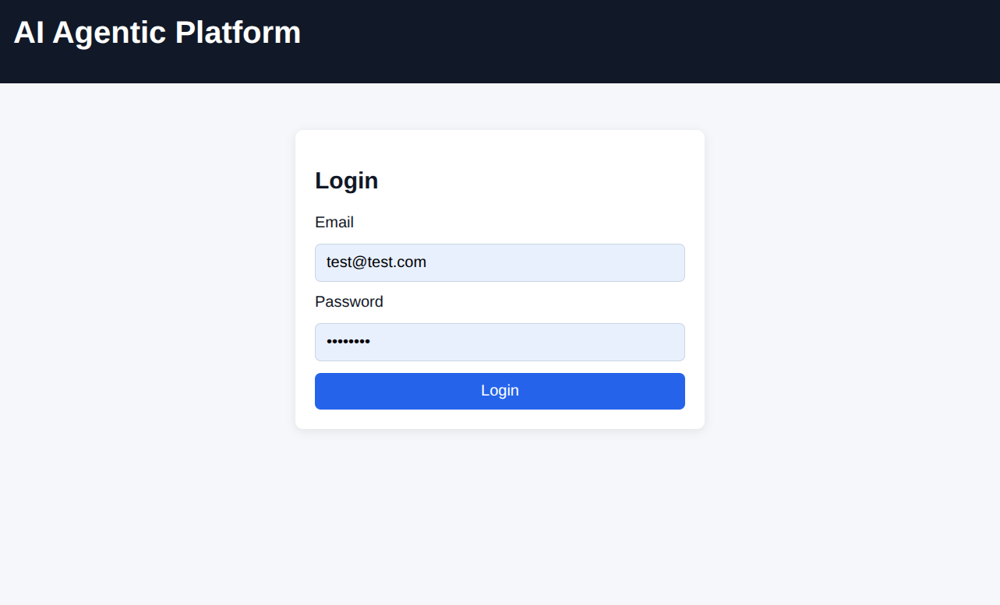
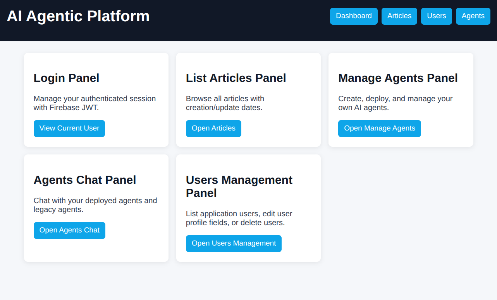
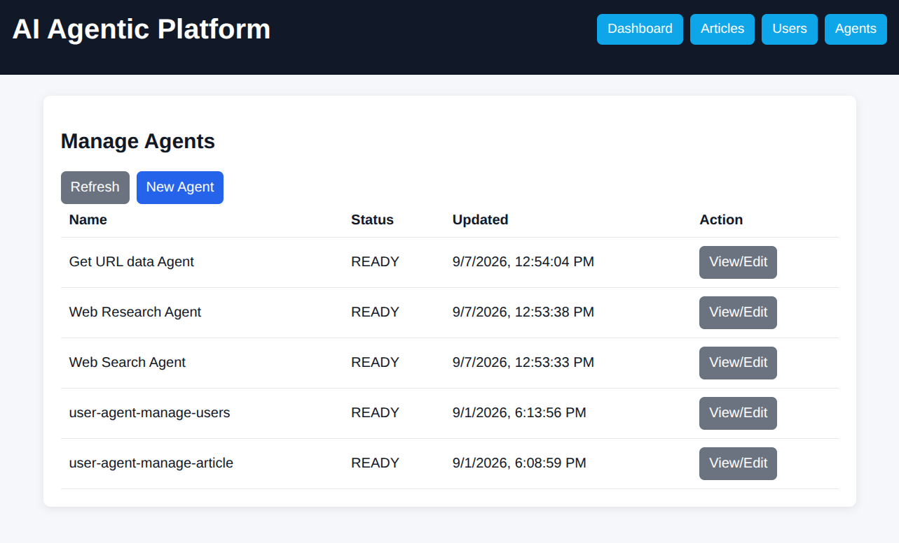
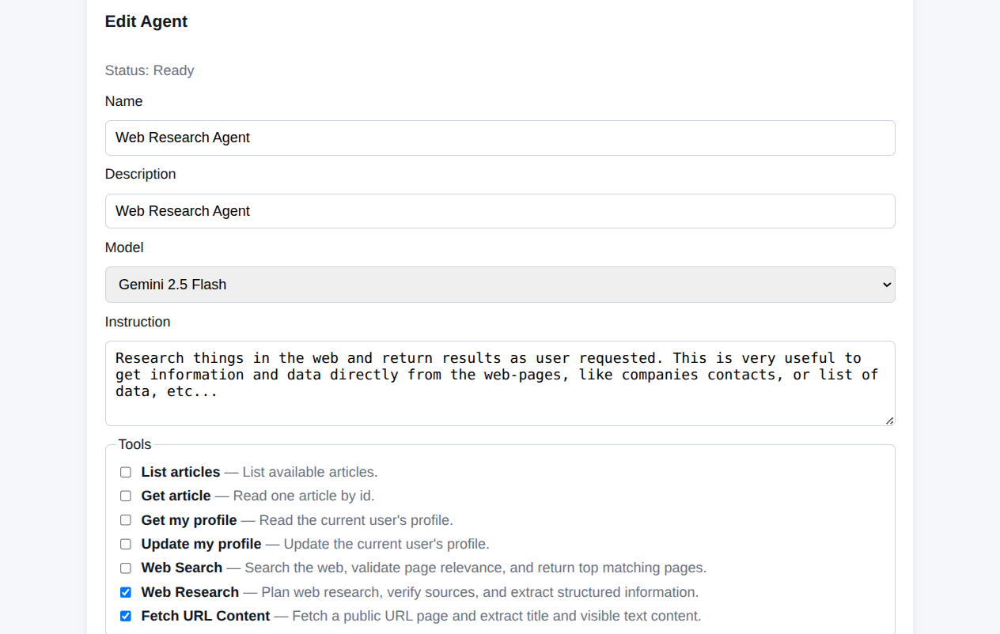
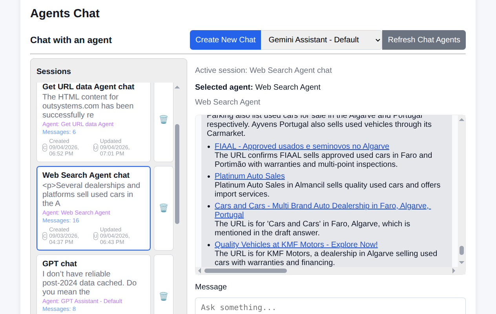
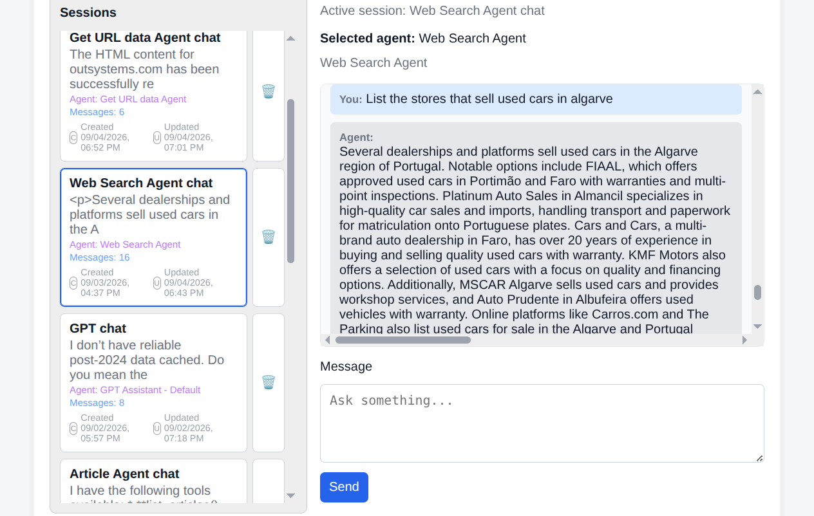

# Personalized AI Agents Platform

Open-source starter kit for building an **agentic platform** where users can create, deploy, and chat with custom AI agents powered by their own tools.

This project provides a production-oriented base architecture with:

- a React frontend for agent management + chat
- Python microservices (FastAPI on Cloud Functions)
- dynamic user agent lifecycle (create, deploy, undeploy)
- pluggable tool handlers (web search, research, URL content fetch, and domain APIs)

## Why this project

If you want to build your own “custom agents” product, this repo gives you the core pieces:

- user-scoped agent definitions
- tool registration and grouping
- chat sessions/history
- deployment pipeline to Google Agent Runtime (ADK/Vertex)
- clear extension points to add your own tools and business services

## Screenshots

Add your product screenshots in a folder like `screenshots/` and reference them here.








## Architecture at a glance

The backend runs as **independently deployable microservices** (auth, articles, users, and agents).

- `frontend/`: React + Vite UI (manage agents, select tools, chat sessions)
- `backend/services/auth_service`: login/auth endpoints
- `backend/services/articles_service`: sample domain service
- `backend/services/users_service`: sample user/profile service
- `backend/services/agents_service`:
  - admin APIs for agent CRUD + deployment orchestration
  - chat APIs for running static and user-defined agents
  - tool handlers under `chat/tool_handlers/`

## Tooling model

Tools are first-class and reusable.  
Current examples include:

- `list_articles`, `get_article`
- `get_my_profile`, `update_my_profile`
- `web_search`
- `web_research`
- `fetch_url_content` (public URL HTML/text extraction)

You can add your own tools by implementing a handler in `backend/services/agents_service/chat/tool_handlers/` and registering it in `chat/tools.py`.

## Quick start (local)

### 1. Backend

```bash
cd backend
python3 -m venv .venv
source .venv/bin/activate
pip install -r requirements.txt
cp .env.example .env
```

Run the services (separate terminals):

```bash
python -m functions_framework --target auth_service --source main.py --port 8091
python -m functions_framework --target articles_service --source main.py --port 8092
python -m functions_framework --target users_service --source main.py --port 8093
python -m functions_framework --target agents_service --source main.py --port 8094
```

### 2. Frontend

```bash
cd frontend
npm install
npm run dev
```

Set frontend envs (example):

```bash
VITE_AUTH_API_BASE_URL=http://localhost:8091
VITE_ARTICLES_API_BASE_URL=http://localhost:8092
VITE_USERS_API_BASE_URL=http://localhost:8093
VITE_AGENTS_API_BASE_URL=http://localhost:8094
```

## Testing

Run backend tests from `backend/`:

```bash
pytest -q tests
```

## Deployment notes

This platform is designed for Google Cloud Functions Gen2 + Vertex/ADK runtime.

- Each service entrypoint configures logging via `LOG_LEVEL`.
- Dynamic user-agent deployment is handled by `agents_service` admin layer.
- For deployed user agents, `LOG_LEVEL` is propagated to runtime env vars.
- You can deploy this stack on GCP with `gcloud` using:
  - **Vertex AI Agent Runtime (ADK / Agent Engines)** for deployed agents
  - **Cloud Functions Gen2** for backend microservices
  - **Cloud Run containers** as an alternative service runtime when needed
  - **Cloud Run MCP servers** for external AI tool providers
  - **Google IAM** for service and runtime access control
  - **Firebase Authentication** for user auth flows
  - **Firestore** for application/session data
  - **Secret Manager** for secure credential/config storage
  - **Artifact Registry** for container/image artifacts
  - **Cloud Tasks** for asynchronous/background job orchestration

See detailed backend deployment instructions in:

- `backend/README.md`

## Extending for your own product

Typical customization path:

1. Replace sample domain services (`articles_service`, `users_service`) with your APIs.
2. Add project-specific tools in `tool_handlers/`.
3. Update frontend tool options for your new tools.
4. Tune agent instructions and planning/execution flows.

## License

See repository license files:

- `LICENSE.md`
- `LICENSE_APACHE_2.md`
- `LICENSE_BSD_3C.md`
- `LICENSE_GNU_LGPL_3.md`